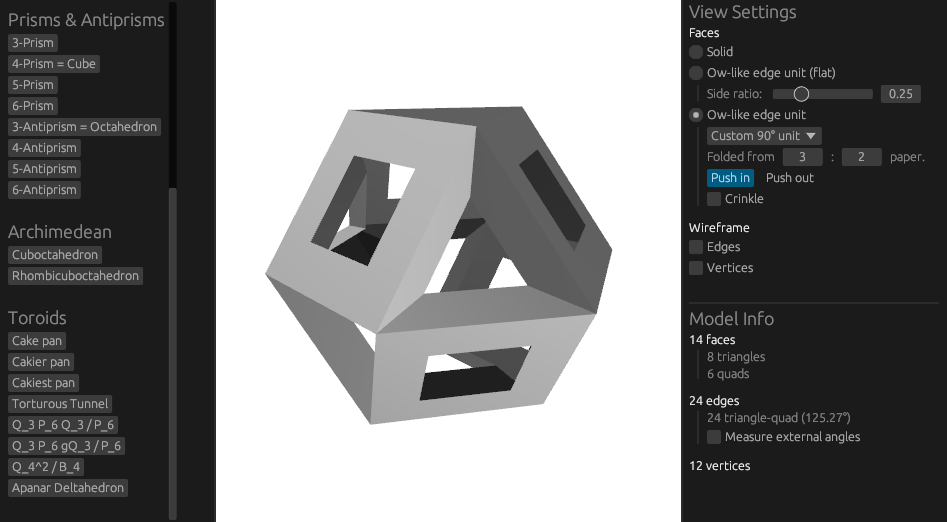
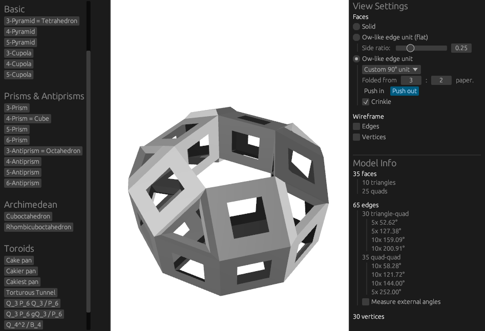
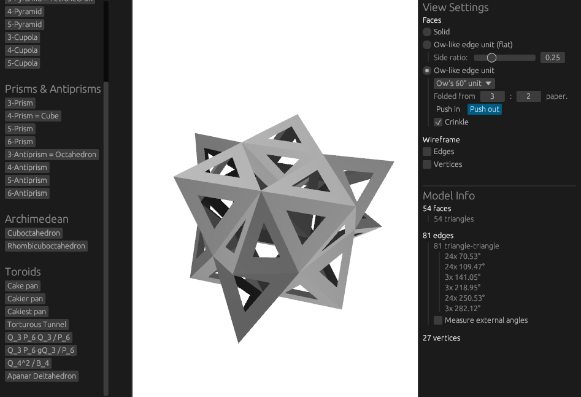

# PolyMod

A visualiser and modelling program for geometric models where all faces are regular.  Designed with
a focus on creating these models with modular origami.

## Screenshots (as of 11th Feb 2024)

